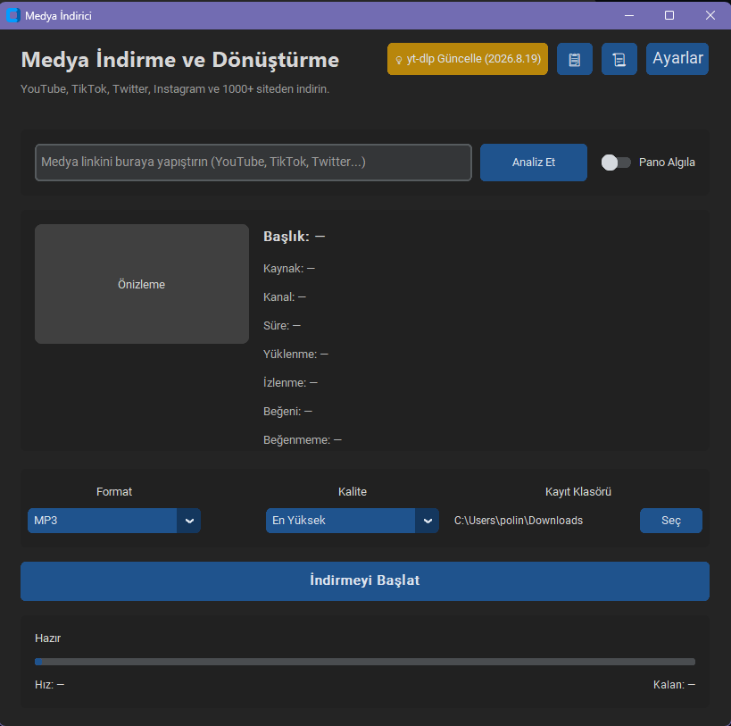

# Medya İndirici

Modern, modüler ve açık kaynak bir **Medya İndirme ve Dönüştürme** masaüstü uygulaması. YouTube ve yt-dlp tarafından desteklenen yüzlerce siteden (YouTube, TikTok, Instagram, Twitter/X ve daha fazlası) video veya ses indirmenizi sağlar; MP4, MP3 ve WAV formatlarına dönüştürme desteği sunar.




---

## Özellikler

- **Link analizi** — Başlık, süre ve thumbnail önizlemesi
- **Çoklu platform desteği** — YouTube, TikTok, Instagram, Twitter/X ve yt-dlp'nin desteklediği diğer siteler
- **Playlist desteği** — Küçük resimli, seçilebilir (checkbox) liste ile toplu indirme
- **Sürükle-bırak** — Pencerenin herhangi bir yerine link (veya birden fazla link) bırakarak indirme başlatma
- **Çoklu format** — MP4 (video), MP3 ve WAV (ses)
- **Kalite seçimi** — En yüksek, 1080p, 720p ve 320 kbps ses
- **Kuyruk tabanlı indirme** — Aynı anda birden fazla indirme (ayarlanabilir eşzamanlılık)
- **İptal / Duraklat-Devam Ettir** — Her indirme (tekil veya playlist içindeki her video) ayrı ayrı iptal edilebilir veya duraklatılıp devam ettirilebilir
- **Hız sınırlama** — İsteğe bağlı KB/s cinsinden indirme hız limiti
- **Altyazı indirme** — Seçilen dillerde altyazıyı `.srt` olarak indirme
- **İndirme Geçmişi** — Tamamlanan indirmelerin platform, başlık ve thumbnail'iyle listesi; klasörde gösterme ve geçmişten silme
- **Çoklu dil desteği** — Türkçe, İngilizce, Almanca, İspanyolca (i18n)
- **Ses bildirimleri** — İndirme tamamlandığında/başarısız olduğunda özelleştirilebilir ses (Windows sistem sesleri veya kendi dosyanız)
- **Sistem tepsisi** — Pencereyi kapatınca arka planda tepsiye küçültme, tepsiden bildirim ve aktif indirme varken çıkış onayı
- **Çerez / oturum desteği** — Giriş gerektiren içerikler için tarayıcı çerezlerini otomatik kullanma veya cookies.txt dosyası belirtme
- **Klasör seçici** — İndirme konumunu özgürce belirleme
- **Arka plan işleme** — Threading ile donmayan arayüz
- **Canlı ilerleme** — Progress bar, hız ve kalan süre göstergesi
- **Karanlık / aydınlık mod** — Sistem teması veya manuel seçim
- **Güncelleme kontrolü** — yt-dlp için sürüm kontrolü
- **Hata yönetimi** — Ağ, geçersiz link ve FFmpeg eksikliği için anlaşılır mesajlar
- **Dosya loglama** — Tüm hata/teşhis mesajları `~/.medya_indirici/logs/` altında günlük log dosyalarına da yazılır

---

## Sistem Gereksinimleri

| Gereksinim | Minimum |
|------------|---------|
| Python | 3.10+ |
| FFmpeg | Sistem PATH'inde erişilebilir olmalı |
| İşletim Sistemi | Windows, macOS, Linux |

### FFmpeg Kurulumu

Uygulama ses/video dönüştürme işlemleri için **FFmpeg** gerektirir.

**Windows:**
1. [ffmpeg.org/download.html](https://ffmpeg.org/download.html) adresinden indirin
2. `bin` klasörünü sistem PATH'ine ekleyin
3. Terminalde `ffmpeg -version` komutuyla doğrulayın

**macOS (Homebrew):**
```bash
brew install ffmpeg
```

**Linux (Debian/Ubuntu):**
```bash
sudo apt update && sudo apt install ffmpeg
```

---

## Kurulum

```bash
# Depoyu klonlayın
git clone https://github.com/KULLANICI_ADINIZ/medya-indirici.git
cd medya-indirici

# Sanal ortam oluşturun (önerilir)
python -m venv venv

# Windows
venv\Scripts\activate

# macOS / Linux
source venv/bin/activate

# Bağımlılıkları yükleyin
pip install -r requirements.txt
```

---

## Kullanım

```bash
python main.py
```

1. Medya linkini yapıştırın (veya pencereye sürükleyip bırakın; panoya kopyalarsanız otomatik algılama açıksa link kutusuna otomatik yazılır)
2. **Analiz Et** butonuna tıklayın
3. Playlist ise indirmek istediğiniz videoları seçin
4. Format ve kaliteyi seçin
5. Kayıt klasörünü belirleyin
6. **İndirmeyi Başlat** ile indirmeyi başlatın — indirme sırasında her satırı ayrı ayrı duraklatabilir/devam ettirebilir veya iptal edebilirsiniz
7. Geçmiş indirmelerinizi üst bardaki 📜 butonundan görüntüleyin
8. Pencereyi kapatırsanız (Ayarlar'da açıksa) uygulama sistem tepsisine küçülür, indirmeler arka planda devam eder

---

## Proje Yapısı

```
medya-indirici/
├── main.py               # Uygulama giriş noktası
├── ui.py                 # CustomTkinter arayüzü
├── downloader.py         # yt-dlp ve FFmpeg iş mantığı
├── providers.py          # Platforma özel indirme ayarları (YouTube/TikTok/Instagram/Twitter/genel)
├── task_queue.py         # Producer-Consumer indirme kuyruğu
├── config.py             # Kalıcı uygulama ayarları
├── i18n.py                # Çoklu dil desteği (tr/en/de/es)
├── history_manager.py    # İndirme geçmişi (JSON persistence)
├── history_dialog.py     # İndirme Geçmişi penceresi
├── batch_dialog.py       # Playlist toplu seçim penceresi
├── settings_dialog.py    # Ayarlar penceresi
├── sound_notifier.py     # Ses bildirimi modülü
├── update_checker.py     # yt-dlp güncelleme kontrolü
├── cookies/               # Kullanıcı çerez dosyaları (git'e dahil değil)
├── docs/                  # Ekran görüntüleri ve belgeler
├── requirements.txt       # Python bağımlılıkları
├── .gitignore
└── README.md
```

---

## Teknoloji Yığını

| Katman | Teknoloji |
|--------|-----------|
| Arayüz | [CustomTkinter](https://github.com/TomSchimansky/CustomTkinter) |
| İndirme | [yt-dlp](https://github.com/yt-dlp/yt-dlp) |
| Dönüştürme | [FFmpeg](https://ffmpeg.org/) (sistem) |
| Görüntü | [Pillow](https://python-pillow.org/) |
| TLS/HTTP2 taklidi (opsiyonel) | [curl_cffi](https://github.com/yifeikong/curl_cffi) |
| Ses (opsiyonel) | [pygame](https://www.pygame.org/) |
| Sürükle-bırak (opsiyonel) | [tkinterdnd2](https://github.com/pmgagne/tkinterdnd2) |
| Sistem tepsisi (opsiyonel) | [pystray](https://github.com/moses-palmer/pystray) |

---

## Katkıda Bulunma

1. Fork yapın
2. Feature branch oluşturun (`git checkout -b feature/yeni-ozellik`)
3. Değişikliklerinizi commit edin
4. Pull Request açın

---

## Lisans

Bu proje açık kaynak olarak paylaşılmaktadır. Kendi lisansınızı `LICENSE` dosyasına ekleyebilirsiniz.

---

## Sorumluluk Reddi

Bu araç yalnızca yasal olarak indirmeye hakkınız olan içerikler için kullanılmalıdır. Telif hakkı sahibi platformların kullanım şartlarına uyun.
=======
